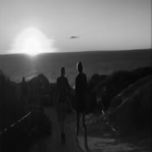
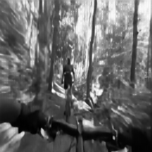
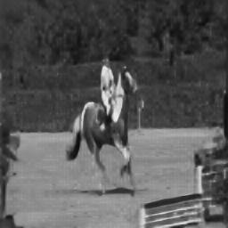
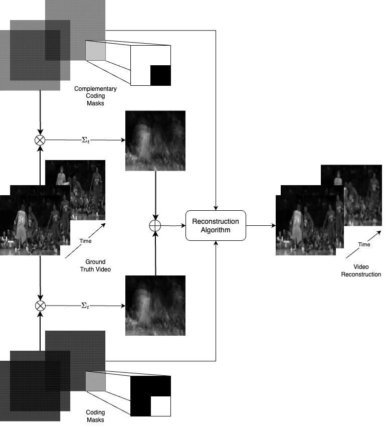

# Towards using Diffusion Models for Compressive Video Recovery from Coded Exposures





## Abstract
Coded exposures capture multiple frames of video within a single measurement image enabling low-speed cameras to capture information from high-speed video. The problem of video recovery from coded exposures involves reconstructing the constituent frames (henceforth, subframes) of the coded image, which is often an ill-posed inverse problem: coded exposures modulate high-speed frames through masks which are then summed together. In this report, we consider using diffusion generative models as the reconstruction algorithm to infuse strong priors on the subframes, while experimenting with baselines from a related problem in snapshot compressive imaging (SCI). In particular, we focus on the method of diffusion posterior sampling (DPS) to move the output subframes towards an image subspace that may correspond to the coded image. DPS works by a measurement loss on top of a pre-trained image diffusion model, and hence it does not require extra training for inference. Extensive results on common video datasets are provided to compare against baselines such as STFormer and a specialized 3D-UNet, which show there is still room for improvement in terms of reconstruction quality and efficiency.



## Getting started

1. Clone the repository

```
git clone https://github.com/dsaragih/video-compressive-recovery

cd video-compressive-recovery
```
2. Download pretrained checkpoints
for [STFormer](https://www.dropbox.com/scl/fo/ojogcdpsg3wiskrfdkdqk/AJAr12AgxS5z7HvnFOCLeeA?rlkey=wslh19ho9h14neq52odnj2u6e&st=moz9jvez&dl=0) and [UNet](https://www.dropbox.com/scl/fo/6i87tjhkuuoxzu4sw2pxd/AHalLxx901-Cm_nKrcZ_rfQ?rlkey=nrqsd4id8vwyk0y3ayd3va99x&st=u4gqtj54&dl=0), and paste into the respective model directories.

3. Follow the README in `diffusion_posterior_sampling` for the prerequisites and package installation instructions.

4. Navigate to respective baseline directories for the instructions on how to run the baselines.

See the [report](/report.pdf) for more details.

## Citation
If you find our work interesting, please consider citing

```
TBA
```